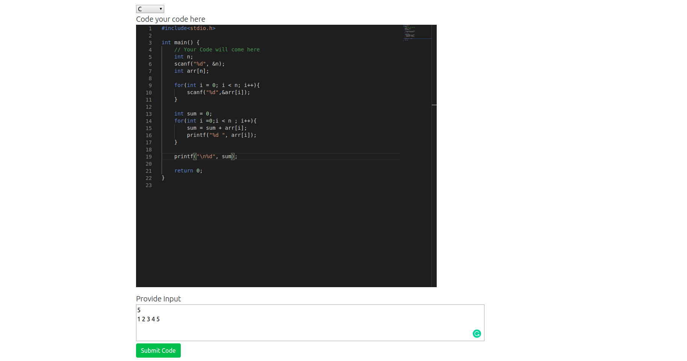
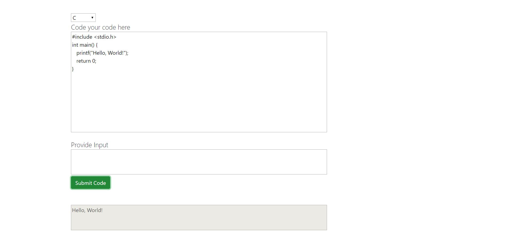
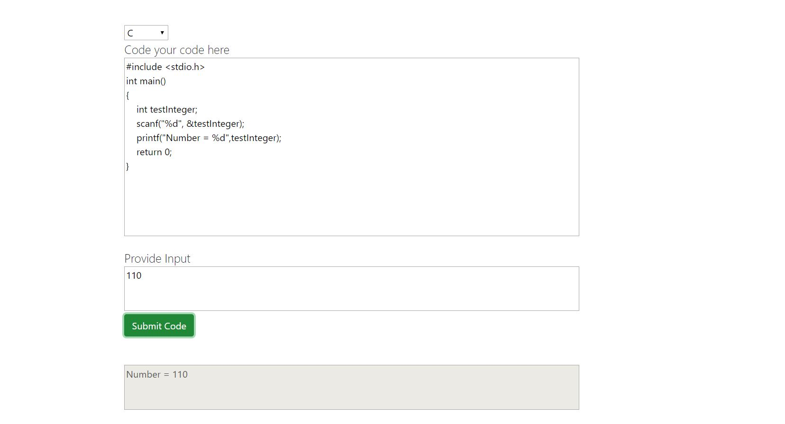
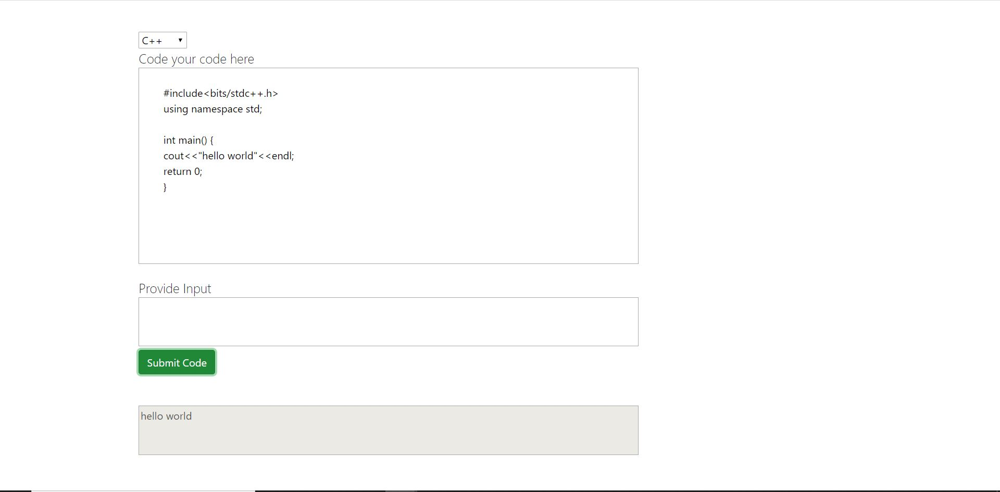
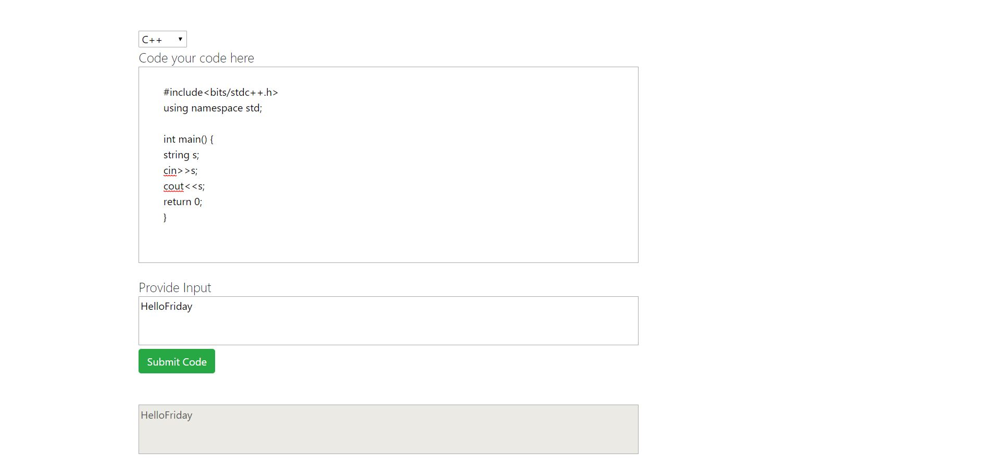
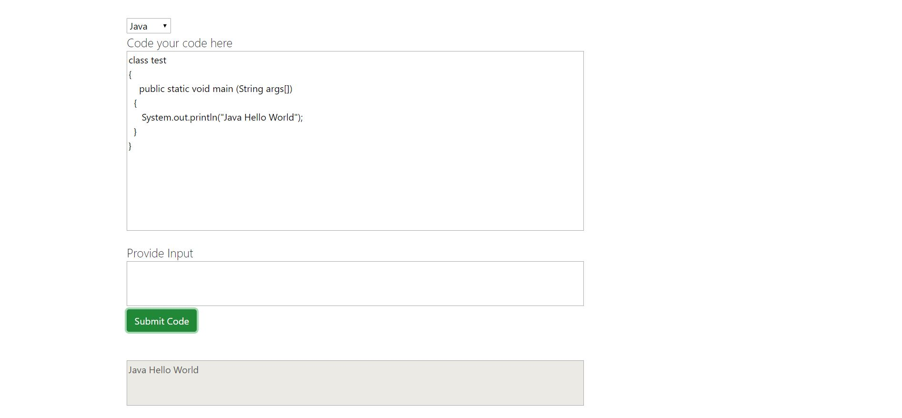
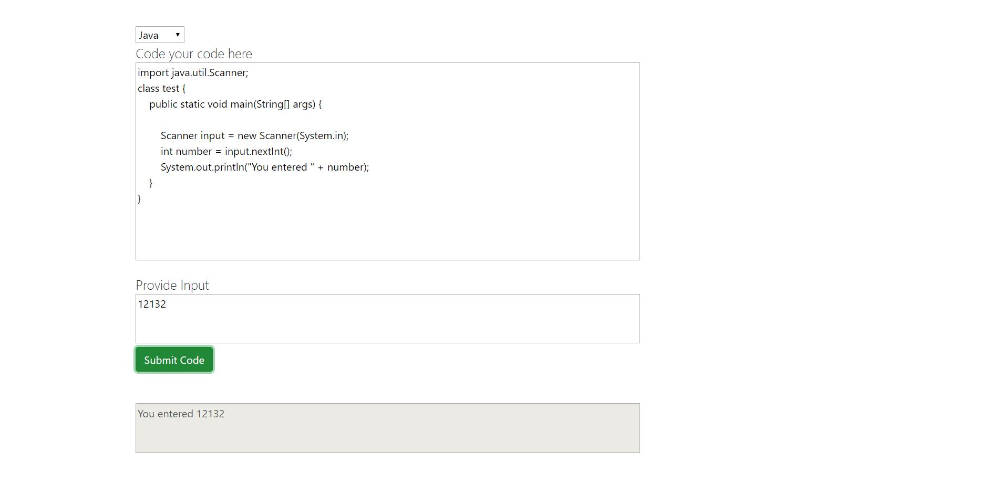
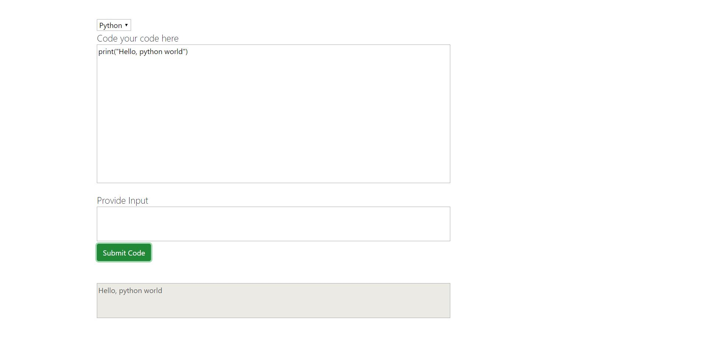
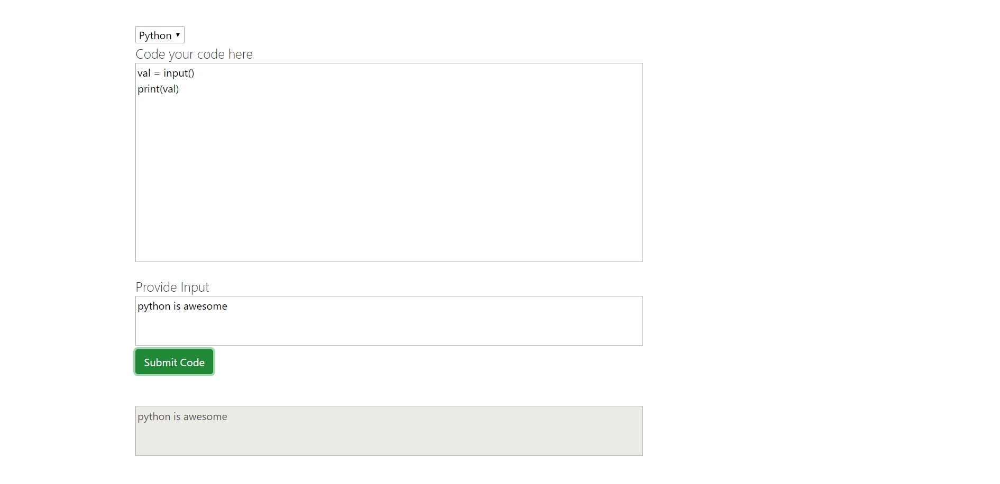

# myIde
This is an interactive IDE for writing code ```Windows only```.

## How to Use
1. Clone this project on your local system
2. Move into ```ide-server``` folder
3. Then run ```npm install``` to install all dependencies that i have used
4. Then ```npm run dev``` to start the server
5. Next move into ```ide-client``` folder
6. Then run ```npm install``` to install all dependencies that i have used
7. Then ```npm start``` to start the react server


## NOTE:-<br>
Remember to set the path of ```C```, ```C++```, ```Java```, ```python``` in your system <br>
by setting environment variables.


### FEATURES

Added VS Code Editor to the app !!!!
Code Editor Look




## All Available Language

1. ### C
#### Without Input


#### With Input



2. ### C++
#### Without Input


#### With Input



3. ### Java
#### Without Input


#### With Input



4. ### Python
#### Without Input


#### With Input

